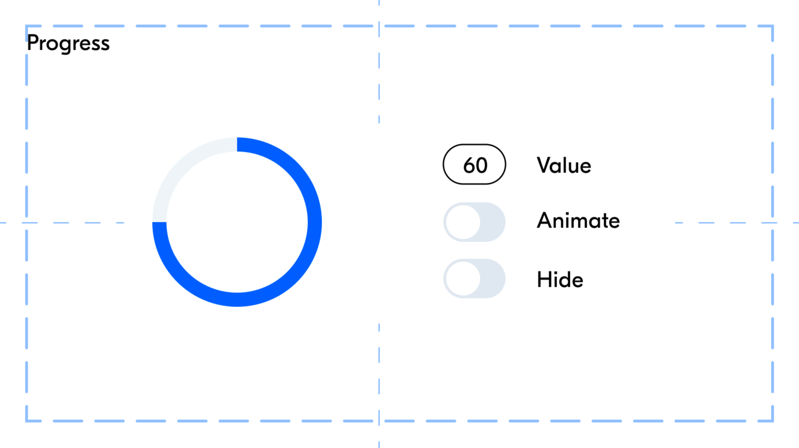

# Progress bar

Блок для отображения прогресса выполнения какого-либо процесса.

## ➡️ [Cсылка на демо](https://kargobober.github.io/progress-bar/) ⬅️



## API

- `render()` - вставить компонент в узел, переданный конструктору
- `setProgress(value)` - установить прогресс (0 - 100)
- `toggleHiding(0 | 1)` - переключить видимость компонента (через visibilty и opacity)
- `toggleAnimation()` - переключить анимацию поворота на 360deg
- `setSize(value)` - установить размер компонента (в пикселях)

## Использование

Импортируйте стили компонента в основной css-файл проекта.

```css
/* index.css */

@import url(../components/progress/index.css);
```

Создайте экземпляр компонента:

```js
// index.js

const container = document.querySelector(".main__container");

const progressStyles = {
  size: "stretch",
  backgroundColor: "transparent",
  stroke: "var(--color-main)",
  backStroke: "var(--color-bg-alt)",
  strokeWidth: 10,
  fill: "transparent",
  transitionDuration: "0.3s",
};

const progress = new Progress(container, "append", progressStyles);
progress.render();
```

### Аргументы конструктора

- `node` - DOM-узел относительно которого будет рендерится компонент
- `method` - `before | prepend | append | after` - метод вставки компонента
- `styles` - объект для конфигурации стилей
- `classPrefix` - префикс для имён классов элементов компонента

### Стилизация

Доступные свойства в объекте-конфигураторе стилей `styles`:

- `size` - число или `"stretch"`. В последнем случае компонент будет растягиваться по наименьшему размеру родителя (по размеру контента, т.е. учитывая padding)
- `stroke` - цвет основной окружности
- `backStroke` - цвет фоновой окружности
- `strokeWidth` - толщина окружностей в пикселях
- `fill` - цвет заливки внутренней части окружности
- `transitionDuration` - длительность анимаций

Данные объекта устанавливаются в атрибуты `svg` или атрибут `style`. Учитывайте это при желании кастомизировать компонент через css.

В css-файле компонента прописано правило для анимации поворота.

## Стек

- JavaScript
- HTML5
- CSS3
- SVG
- адаптивный дизайн
